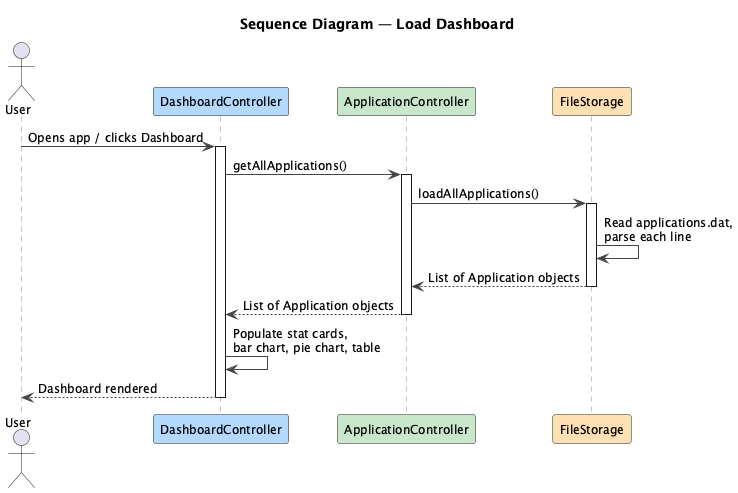
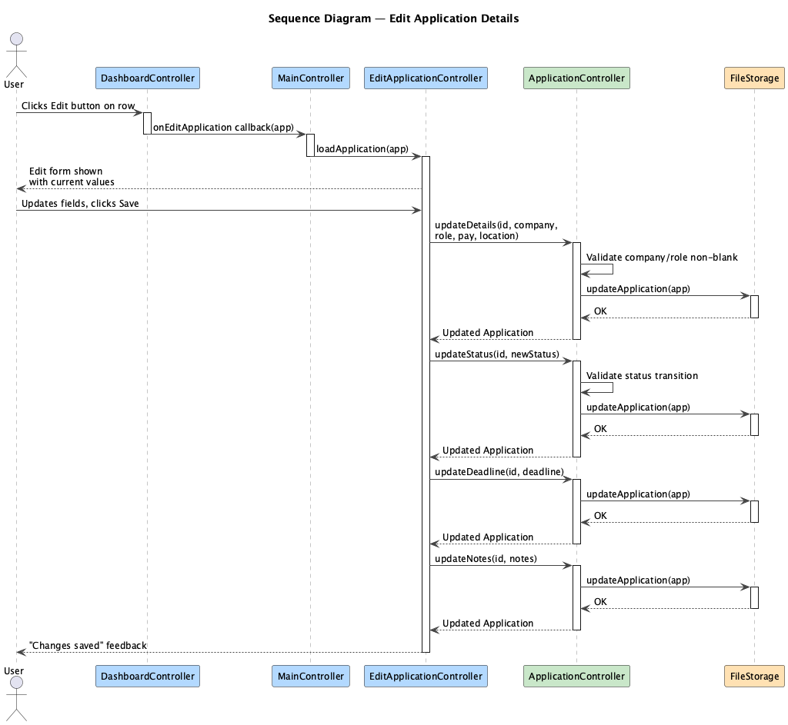
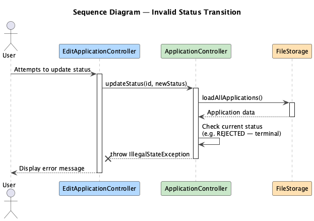
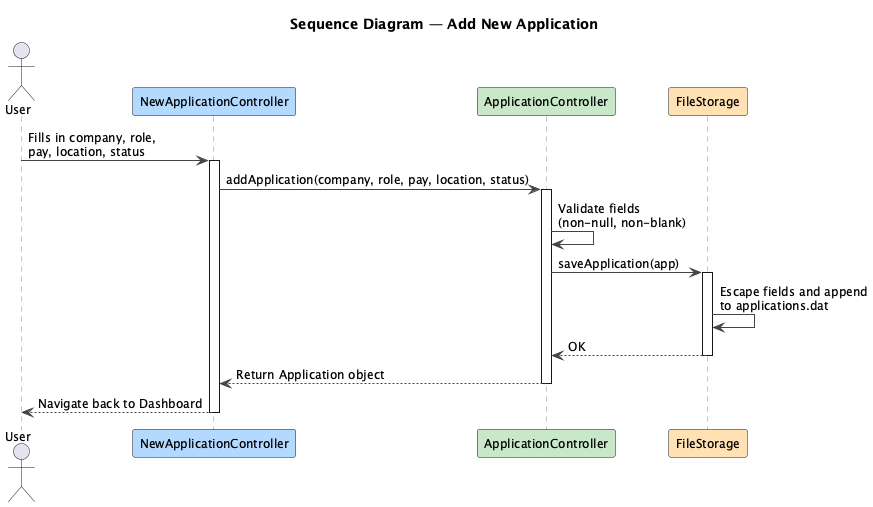
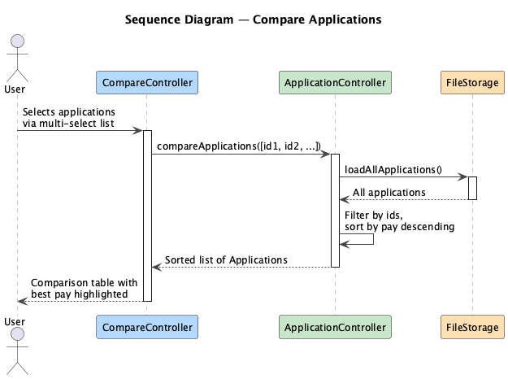
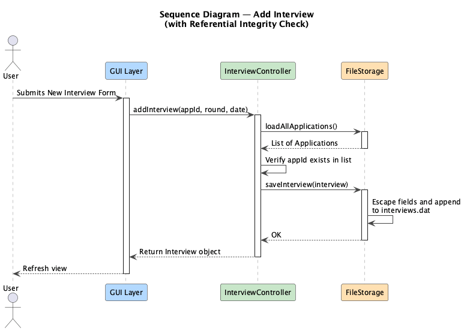

# Developer Guide

This section covers the technical documentation of JobApps Tracker.

## Table of Contents

1. [Architecture](#architecture)
2. [Class Diagram](#class-diagram)
3. [Implementation](#implementation)
   1. [Entry Point](#entry-point)
   2. [Activity Diagram](#activity-diagram)
   3. [GUI Layer](#gui-layer)
      1. [MainController](#maincontroller)
      2. [DashboardController](#dashboardcontroller)
         1. [Feature: Viewing Applications](#feature-viewing-applications)
      3. [EditApplicationController](#editapplicationcontroller)
         1. [Feature: Editing an Application](#feature-editing-an-application)
         2. [Feature: Invalid Status Transition](#feature-invalid-status-transition)
      4. [NewApplicationController](#newapplicationcontroller)
         1. [Feature: Adding an Application](#feature-adding-an-application)
      5. [CompareController](#comparecontroller)
         1. [Feature: Comparing Applications](#feature-comparing-applications)
      6. [CalendarController](#calendarcontroller)
   4. [Logic Layer](#logic-layer)
      1. [ApplicationController](#applicationcontroller)
      2. [InterviewController](#interviewcontroller)
         1. [Feature: Adding an Interview](#feature-adding-an-interview)
      3. [ReminderService](#reminderservice)
   5. [Storage Layer](#storage-layer)
      1. [FileStorage](#filestorage)
4. [Testing](#testing)

## Prerequisites

You can fork the repository [here](https://github.com/JobApplications-Tracker/JobApps-Tracker).

Dependencies for the project can be found in `build.gradle`.

Java JDK version used: **17**

Build tool: **Gradle**

JavaFX version: **21**

---

## Architecture

The architecture of the app follows a strict **3-Tier Layered Architecture** to ensure separation of concerns. The GUI layer strictly consumes the Logic layer's API and never interacts directly with the Storage layer.


The internal workings of the application can be summarised into three layers:

1. **GUI Layer** — JavaFX controllers and FXML views responsible for all user interaction
2. **Logic Layer** — Business logic controllers that enforce rules and coordinate with storage
3. **Storage Layer** — Flat-file persistence using pipe-delimited `.dat` files

---

## Class Diagram

The full class diagram is shown below. The entry point `Launcher` is omitted as it does not affect the internal functionality of the application.


---

## Implementation

### Entry Point

The entry point of the application is `Launcher`, which delegates to `Main` to initialise the JavaFX runtime and load `MainWindow.fxml`. `MainController` is then responsible for all subsequent navigation.

---

### Activity Diagram

The activity diagram below shows the main user workflow through the application, covering all major actions: adding, editing, deleting, searching, comparing, and browsing the calendar.


---

### GUI Layer

#### MainController

`MainController` owns the single shared instances of `FileStorage`, `ApplicationController`, `InterviewController`, and `ReminderService`. It manages navigation between all views and injects the appropriate dependencies into each child controller.

---

#### DashboardController

`DashboardController` manages the main dashboard view, including the stat cards, bar chart, pie chart, application table, and search field.

##### Feature: Viewing Applications

The sequence diagram below visualises the interactions when the dashboard loads.

Precondition: The application has launched and `MainController` has initialised all dependencies.



---

#### EditApplicationController

`EditApplicationController` manages the edit form view, allowing the user to update all fields of an existing application.

##### Feature: Editing an Application

The sequence diagram below visualises the interactions when the user saves changes to an application.

Precondition: The user has navigated to the edit form for an existing application.



##### Feature: Invalid Status Transition

The sequence diagram below visualises the interactions when the user attempts a status transition that violates the business rules, such as modifying a terminal-state application or skipping the `INTERVIEWING` stage.

Precondition: The user is on the edit form and attempts to change the status to an invalid target.



---

#### NewApplicationController

`NewApplicationController` manages the new application form, validates input, and delegates to `ApplicationController` to persist the new record.

##### Feature: Adding an Application

The sequence diagram below visualises the interactions when a new application is submitted.

Precondition: The user has filled in at least the required fields (company, role, status).



---

#### CompareController

`CompareController` manages the compare view, allowing the user to select multiple applications and view them side by side sorted by pay.

##### Feature: Comparing Applications

The sequence diagram below visualises the interactions when the user selects applications to compare.

Precondition: At least one application exists in storage.



---

#### CalendarController

`CalendarController` manages the monthly calendar grid, aggregating deadlines, interviews, and reminders from all three logic controllers and rendering them as colour-coded badges within each day cell.

---

### Logic Layer

#### ApplicationController

`ApplicationController` handles all CRUD operations for `Application` records. It enforces the status transition rules described below and validates input before delegating to storage.

Terminal states (`REJECTED`, `ACCEPTED`, `WITHDRAWN`) cannot be transitioned out of. Jumping directly from `APPLIED` to `OFFER` is also prohibited.

---

#### InterviewController

`InterviewController` handles creation and retrieval of `Interview` records. It enforces referential integrity by verifying the parent application exists before saving.

##### Feature: Adding an Interview

The sequence diagram below visualises the interactions when a new interview is added, including the referential integrity check against the parent application.

Precondition: At least one application exists in storage.



---

#### ReminderService

`ReminderService` handles creation, querying, and dismissal of `Reminder` records. Reminders are filtered by a look-ahead window and exclude dismissed entries.

---

### Storage Layer

#### FileStorage

`FileStorage` is the concrete implementation of the `Storage` interface. It persists all data to pipe-delimited `.dat` files in the `data/` directory at the application root.

| File | Contents |
|---|---|
| `data/applications.dat` | All application records |
| `data/interviews.dat` | All interview records |
| `data/reminders.dat` | All reminder records |

All user input is sanitised before writing — pipe characters (`|`) are escaped to `&#124;` to prevent field corruption and unescaped on load. Corrupted lines are silently skipped and logged at `WARNING` level without crashing the application.

**Example application record:**

```
f3a9b2c1-...|Meta|PM Intern|8500.0|Remote|OFFER|2026-01-20|2026-04-28|Referred by a friend
```

Field order: `id | companyName | roleTitle | pay | location | status | dateApplied | deadline | notes`

This is an example of the object diagram for two sample applications.


---

## Testing

To learn more about the testing methodology and how to run tests, refer to the [Testing Guide](./testingGuide.md).

---

You have reached the end of the developer guide!

To head back, click [here](./README.md)