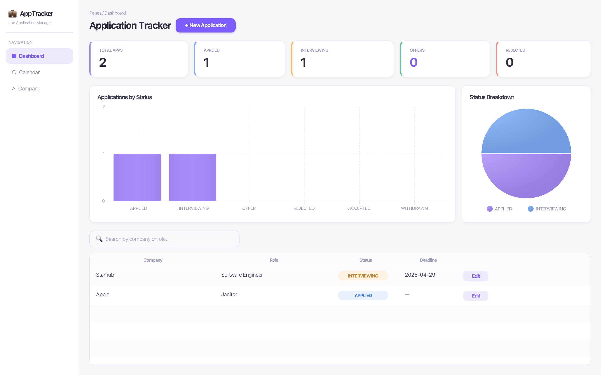
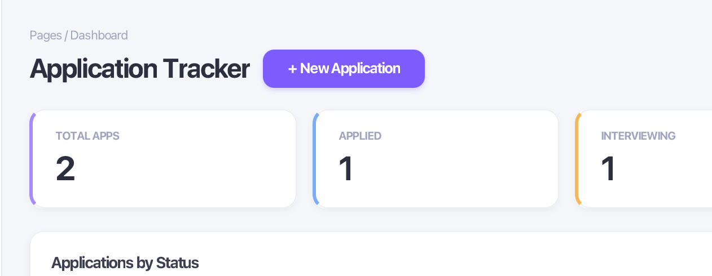
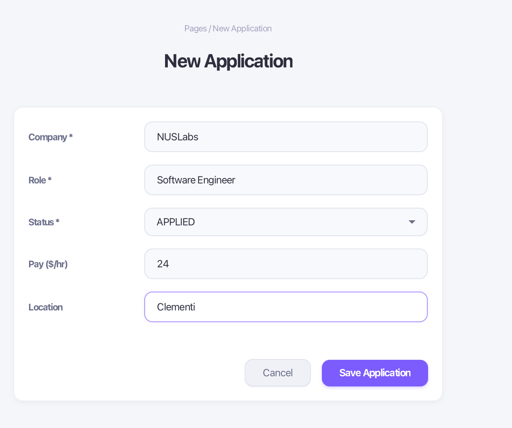
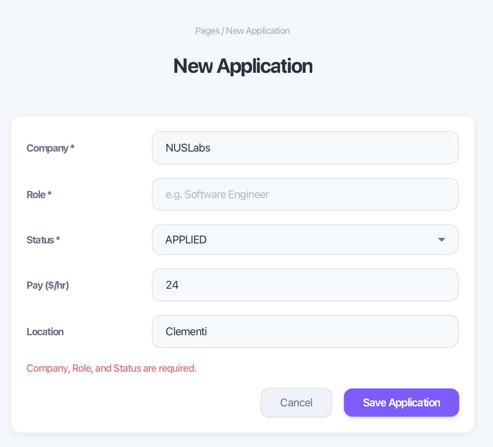
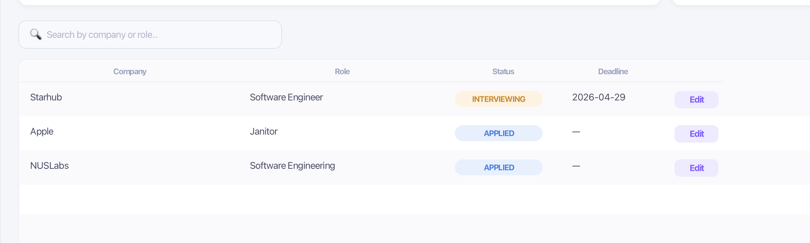
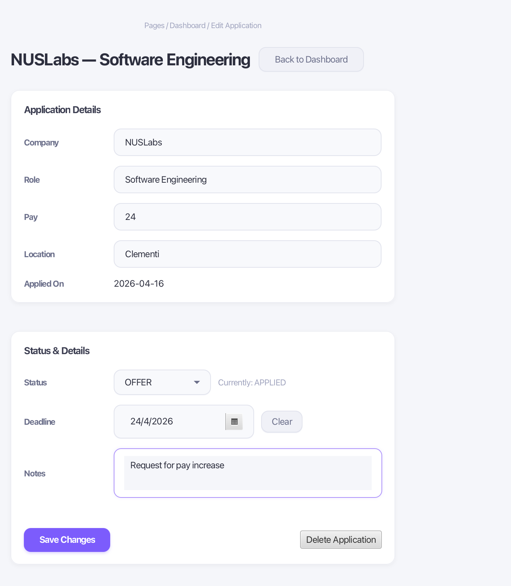
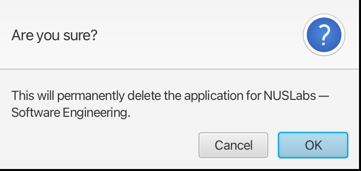
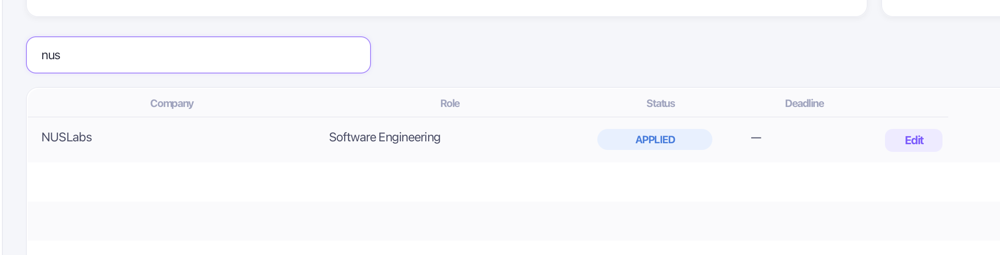
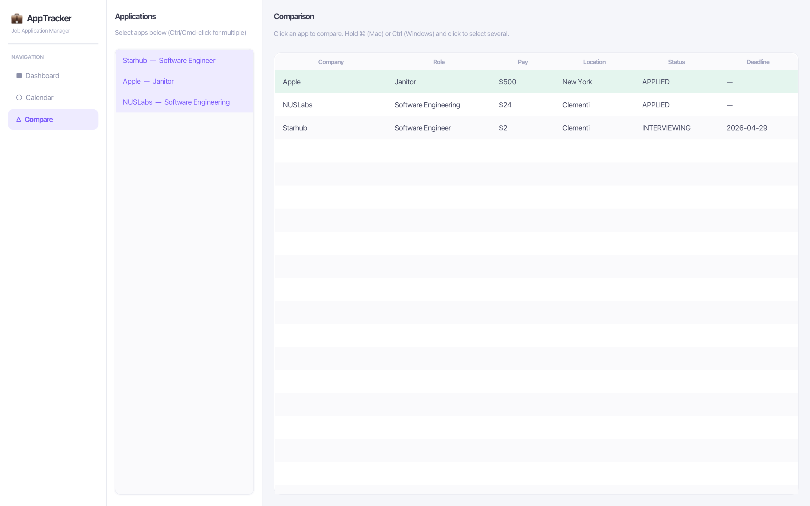
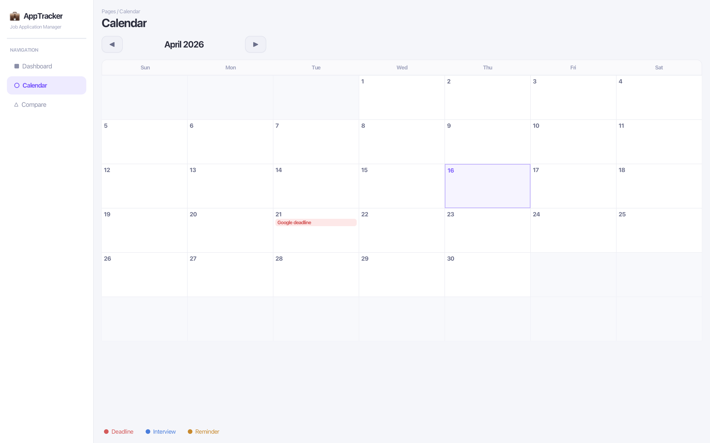

# JobApps Tracker — User Guide



JobApps Tracker is a desktop application for managing and tracking your internship and job applications in one place. Track statuses, set deadlines, schedule interviews, compare opportunities side by side, and review your progress on an interactive calendar — all without relying on external services.

---

## Table of Contents

- [Getting Started](#getting-started)
- [Using JobApps Tracker](#using-jobapps-tracker)
    - [Adding a New Application](#adding-a-new-application)
    - [Editing an Application](#editing-an-application)
    - [Deleting an Application](#deleting-an-application)
    - [Searching and Filtering](#searching-and-filtering)
    - [Comparing Applications](#comparing-applications)
    - [Using the Calendar](#using-the-calendar)
- [Features](#features)
    - [Application Tracking Dashboard](#application-tracking-dashboard)
    - [Status Workflow](#status-workflow)
    - [Edit Application](#edit-application)
    - [Comparison Tool](#comparison-tool)
    - [Calendar View](#calendar-view)

---

## Getting Started

- Ensure **Java 17** is installed on your computer. To simplify setup, we recommend using **Azul Zulu JDK 17 FX**, which bundles JavaFX. Download it [here](https://www.azul.com/downloads/?version=java-17-lts&package=jdk-fx#zulu).
- Download `jobapps-tracker.jar` from [here](https://github.com/JobApplications-Tracker/JobApps-Tracker/releases).
- Open your terminal.
- Navigate to the folder containing `jobapps-tracker.jar`.
- Run the command:

```
java -jar jobapps-tracker.jar
```

If the app fails to launch, your system may require the JavaFX module path to be specified explicitly. If your JavaFX SDK is stored at `C:\javafx-sdk-21.0.7`, run:

```
java --module-path C:\javafx-sdk-21.0.7\lib --add-modules javafx.controls,javafx.fxml -jar jobapps-tracker.jar
```

> **Minimum window size:** 900 × 600. Resize if any content appears clipped.

---

## Using JobApps Tracker

### Adding a New Application

1. From the **Dashboard**, click the **+ New Application** button in the top right.
   
2. Fill in the required fields:
    - **Company** *(required)* — e.g. `Google`
    - **Role** *(required)* — e.g. `Software Engineer Intern`
    - **Status** *(required)* — select an initial status (`Applied` or `Interviewing`)
3. Optionally fill in:
    - **Pay** — e.g. `9000` (numeric only)
    - **Location** — e.g. `Singapore`
4. Click **Save Application**.
   

   If any required field is left empty, an error message will appear below the form. If Pay is filled with a non-numeric value, you will see **"Pay must be a valid number."**
   

5. Click **Cancel** at any time to return to the Dashboard without saving.

---

### Editing an Application

1. From the Dashboard table, locate the application you want to edit.
2. Click the **Edit** button on that row, or **double-click** the row directly.
   
3. The edit form will open pre-filled with the application's current values.
4. Update any of the following fields:
    - **Company**, **Role**, **Pay**, **Location** — in the *Application Details* card
    - **Status** — select a new status from the dropdown in the *Status & Details* card
    - **Deadline** — pick a date or click **Clear** to remove it
    - **Notes** — free-text field for any remarks
5. Click **Save Changes**. A confirmation message will appear inline:
    - **"Changes saved successfully."** — at least one field was updated.
    - **"No changes to save."** — no fields were modified.
      

6. Click **Back to Dashboard** at any time to return without saving the current edits.

> **Note:** Changes are saved one field group at a time. If an error occurs mid-save (e.g. a status transition violation), only the steps completed before the error will be persisted.

---

### Deleting an Application

1. Open the edit form for the application you want to remove (see [Editing an Application](#editing-an-application)).
2. Click **Delete Application** at the bottom right of the form.
3. A confirmation dialog will appear asking you to confirm the deletion.
   
4. Click **OK** to permanently delete the application, or **Cancel** to go back.

> ⚠️ Deletion is permanent. Associated interviews and reminders stored for that application will remain in storage but will no longer be linked to an active record.

---

### Searching and Filtering

From the Dashboard, use the **search bar** above the application table to filter results in real time.

- Searches match against **company name** and **role title**, case-insensitively.
- The table updates as you type — no need to press Enter.
  

---

### Comparing Applications

1. Click **Compare** in the left sidebar.
2. From the **Applications** panel on the left, click any application to select it.
    - Hold **Ctrl** (Windows/Linux) or **Cmd** (macOS) and click to select multiple applications.
3. The **Comparison** table on the right updates automatically, showing the selected applications sorted by pay (highest first).
4. The row with the **highest pay** is highlighted in green.
   

---

### Using the Calendar

1. Click **Calendar** in the left sidebar.
2. The calendar displays the current month. Use the **◀** and **▶** arrows to navigate between months.
   
3. A legend at the bottom of the calendar identifies each badge type.

> The calendar is view-only. To add or modify deadlines, interviews, or reminders, use the edit form on the Dashboard.

---

## Features

### Application Tracking Dashboard

The Dashboard is the main view of the app and loads automatically on launch. It provides a full overview of your applications at a glance.

**Stat cards** across the top show:
- **Total Apps** — total number of applications stored
- **Applied** — applications in the `APPLIED` state
- **Interviewing** — applications currently in the `INTERVIEWING` state
- **Offers** — applications that have received an `OFFER`
- **Rejected** — applications with a `REJECTED` outcome

**Charts** below the stat cards include:
- **Applications by Status** — a bar chart showing the count per status
- **Status Breakdown** — a pie chart with a legend showing proportions

**Applications table** at the bottom lists all your applications with columns for Company, Role, Status (shown as a colour-coded pill), Deadline, and an Edit button.

---

### Status Workflow

Each application follows a structured status lifecycle. The valid transitions are:

```
APPLIED ──► INTERVIEWING ──► OFFER ──► ACCEPTED
   │               │            │
   ▼               ▼            ▼
REJECTED        REJECTED     REJECTED
   │               │
WITHDRAWN       WITHDRAWN
```

**Terminal states** — once an application reaches `ACCEPTED`, `REJECTED`, or `WITHDRAWN`, its status can no longer be changed. Attempting to do so will display an error message inline in the edit form.

**Invalid transitions** — jumping directly from `APPLIED` to `OFFER` (bypassing `INTERVIEWING`) is not permitted and will produce an error.

---

### Edit Application

The edit form allows full modification of a saved application. Fields are split into two cards:

**Application Details**
| Field | Required | Notes |
|---|---|---|
| Company | Yes | Cannot be blank |
| Role | Yes | Cannot be blank |
| Pay | No | Must be a valid non-negative number |
| Location | No | Free text |
| Applied On | — | Read-only; set at creation time |

**Status & Details**
| Field | Notes |
|---|---|
| Status | Must follow valid transition rules |
| Deadline | Date picker; click **Clear** to remove |
| Notes | Free text; saved as empty string if cleared |

---

### Comparison Tool

The Compare view allows you to select multiple applications and review them side by side in a sortable table.

- **Columns shown:** Company, Role, Pay, Location, Status, Deadline
- **Sort order:** Always by pay, highest to lowest
- **Best pay highlight:** The top-paying row is highlighted in green
- **Selection:** Uses standard multi-select (`Ctrl/Cmd + click`)

The comparison table is read-only. To make changes, navigate back to the Dashboard and use the Edit button.

---

### Calendar View

The Calendar view renders a monthly grid showing all upcoming events derived from your saved applications:

- **Deadlines** — sourced from the `deadline` field on each application
- **Interviews** — sourced from scheduled interview records linked to an application
- **Reminders** — sourced from reminder records; types include `DEADLINE`, `INTERVIEW`, and `FOLLOWUP`

Each event badge shows a short label (truncated if needed) and is colour-coded by type. Today's date is highlighted with a purple border.

---

You have reached the end of the user guide!

To head back, click [here](./README.md)